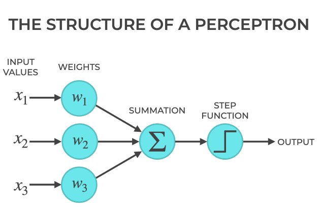
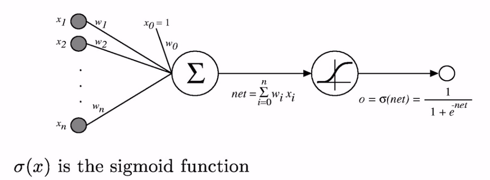
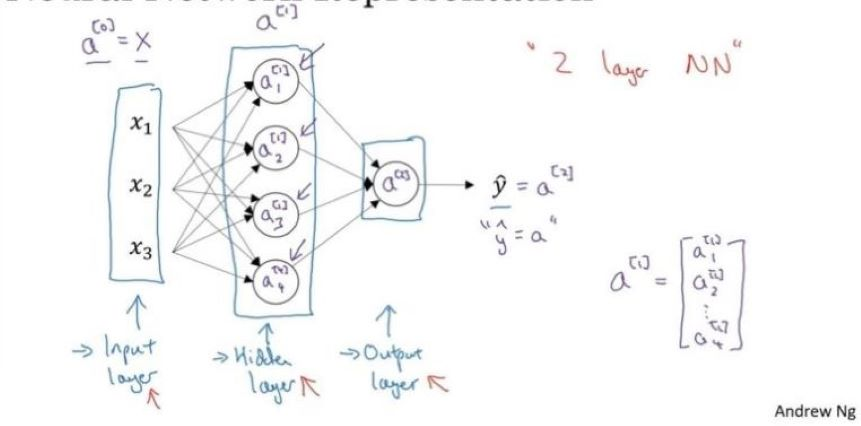
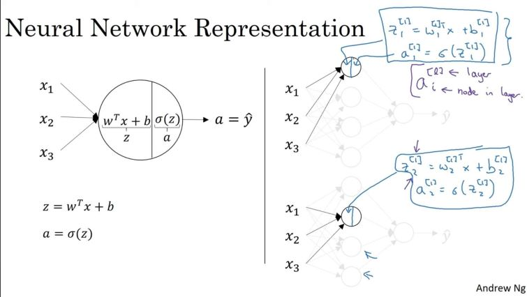
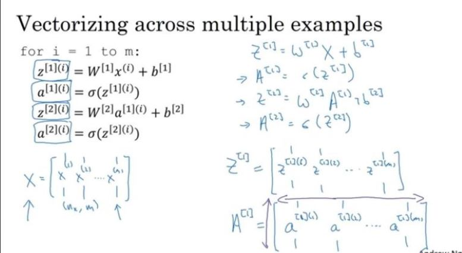
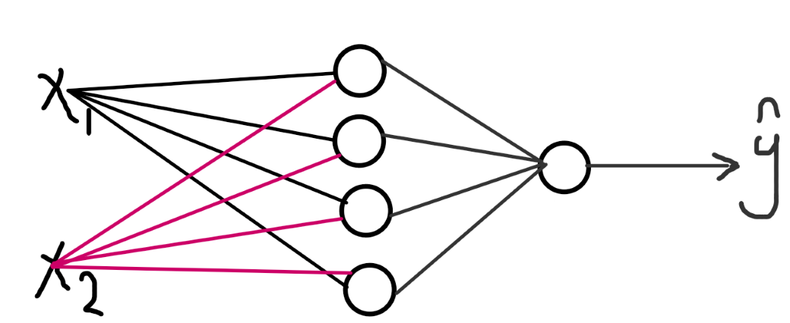
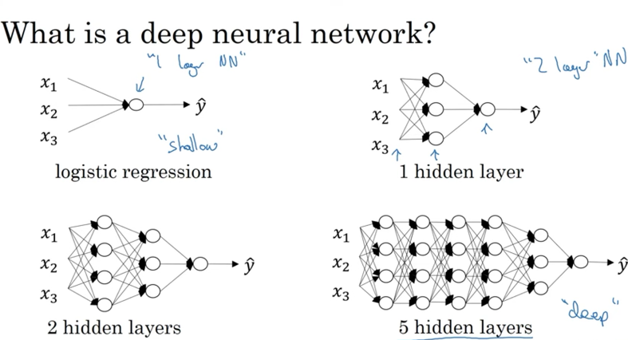
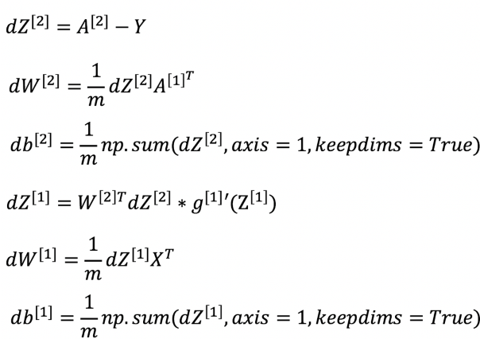

#### Course 1: Neural Networks and Deep Learning - Part of the Deep Learning Specialization

# Agenda
| Section | Description |
|---------|-------------|
| [What is a (Neural Network) NN?](#what-is-a-neural-network-nn) | Introduction to neural networks and their components. |
| [Single Neuron (Shallow Model)](#1-single-neuron-shallow-model) | Explanation of a single neuron and its mechanism. |
| [Introducing the Sigmoid Function](#introducing-the-sigmoid-function) | Comparison of perceptron and sigmoid function. |
| [Supervised learning with neural networks](#supervised-learning-with-neural-networks) | Overview of supervised learning and types of neural networks. |
| [Why is deep learning taking off?](#why-is-deep-learning-taking-off) | Factors contributing to the rise of deep learning. |
| [Neural Networks Basics](#neural-networks-basics) | Setting up machine learning problems with neural networks. |
| [Binary classification](#binary-classification) | Explanation of logistic regression for binary classification. |
| [Gradient Descent](#gradient-descent) | Overview of the gradient descent algorithm. |
| [Neural Network Representation](#neural-network-representation) | Visual representation of neural networks. |
| [Computing Neural Network's Output](#computing-neural-networks-output) | Process of computing outputs in neural networks. |
| [Dimension of Each Parameter in Neural Network Equations](#dimention-of-each-parameter-in-neural-network-equations) | Explanation of parameter dimensions in neural network equations. |
| [Random Initialization](#random-initialization) | Importance of random initialization in neural networks. |
| [Vectorization](#vectorization) | Benefits and techniques of vectorization in neural networks. |
| [Activation functions](#activation-functions) | Overview of different activation functions used in neural networks. |
| [Deep L-layer NN](#deep-l-layer-nn) | Introduction to deep neural networks. |
| [The main steps for building a Neural Network](#the-main-steps-for-building-a-neural-network) | Steps to construct a neural network. |
| [Forward Propagation](#forward-propagation) | Explanation of the forward propagation process. |
| [Backward Propagation](#backward-propagation) | Overview of the backward propagation process. |
| [Difference Between Parameters and Hyperparameters](#difference-between-parameters-and-hyperparameters) | Distinction between parameters and hyperparameters in neural networks. |
| [Neural networks (NNs) and the brain](#neural-networks-nns-and-the-brain) | Simlarity of Neural networks (NNs) and the brain. |
| [Credits](#credits) | |

## What is a (Neural Network) NN?
> A neural network is a model inspired by the human brain, consisting of units (neurons) that work together to process inputs and generate outputs. These neurons apply weights to the inputs, sum them up, and pass the result through an activation function to decide the output.
### 1. Single Neuron (Shallow Model)
A single neuron (or perceptron) is the simplest form of a neural network, often referred to as a shallow model. It performs linear regression without using an activation function.
- Perceptron Mechanism:
    - The perceptron takes an input (real values or boolean) and multiplies it by weights.
    - It calculates a weighted sum of the input ($W^T \cdot X$), where $𝑊$ is the weight vector and $X$ is the input vector. 
    - Then, it applies a threshold to this sum. If the sum crosses the threshold, it predicts a positive output (1), otherwise a negative output (0).
- Example:<br>
    - **Inputs**: A student's exam score $X$.
    - **Weights and Bias**: Weight $W = 0.5$, Bias $b = -50$
    - **Weighted Sum Calculation**: $z = W \cdot X + b = 0.5 \cdot X - 50$
    - **Threshold**:
        - If $z \geq 0$, output 1 (Pass).
        - If $z < 0$, output 0 (Fail).
    - For $X = 100$:&nbsp;
        $z = 0.5 \cdot 100 - 50 = 0 \quad (\text{Output: 1, Pass})$
    - For $X = 80$:&nbsp; 
        $z = 0.5 \cdot 80 - 50 = -10 \quad (\text{Output: 0, Fail})$

    This shows how a perceptron makes a binary pass/fail decision based on a student's exam score.
- Perceptron's Limitation:
  - A perceptron can only produce binary outputs (0 or 1).
  - Small changes in weights or bias can cause the perceptron to flip its output drastically, which is not ideal for many problems.
  - This leads to its inability to handle small adjustments smoothly.
### Introducing the Sigmoid Function:
To solve this problem, the sigmoid function is introduced. Unlike the perceptron that outputs binary values (0 or 1), the sigmoid function allows for smooth, gradual changes in the output. This means that small changes in the weights or biases produce small changes in the output, making it more flexible for problems where we need non-binary outputs.
- Sigmoid Function:<br>
The sigmoid activation function is mathematically defined as:
$$\sigma(x) = \frac{1}{1 + e^{-x}}$$
- It gives a continuous output between 0 and 1.
- This makes it better suited for tasks where you want a gradual change in the output instead of a sudden flip (like in a perceptron).

To sum up differences (Perceptron vs. Sigmoid Function):
- Perceptron: Outputs binary values (0 or 1) based on a threshold.
- Sigmoid Function: Outputs values between 0 and 1, allowing for smoother changes in the input.

|  |  |
|-----------------------|-----------------------|

## Supervised learning with neural networks
> Supervised learning means we have the (X,Y) and we need to get the function that maps X to Y.
- Different types of neural networks for supervised learning which includes:
  - CNN or convolutional neural networks (Useful in computer vision)
  - RNN or Recurrent neural networks (Useful in Speech recognition or NLP)
  - Standard NN (Useful for Structured data)
  - Hybrid/custom NN or a Collection of NNs types
- Structured data is like the databases and tables.
- Unstructured data is like images, video, audio, and text.
- Structured data gives more money because companies relies on prediction on its big data.
## Why is deep learning taking off?
1. Data: 
    - For small data NN can perform as Linear regression or SVM (Support vector machine)
    - For big data a small NN is better that SVM
    - For big data a big NN is better that a medium NN is better that small NN.
2. Computation:
    - GPUs.
    - Powerful CPUs.
    - Distributed computing.
    - ASICs
3. Algorithm:
    Creative algorithms has appeared that changed the way NN works.
    - For example using RELU function is so much better than using SIGMOID function in training a NN because it helps with the vanishing gradient problem (will see in C2).
## Neural Networks Basics
Learn to set up a machine learning problem with a neural network mindset. Learn to use vectorization to speed up your models.
### Binary classification
Mainly he is talking about how to do a logistic regression to make a binary classifier.
#### Logistic regression
Algorithm is used for classification algorithm of 2 classes.
- Simple equation:	$z = W^T \cdot X + b$
- If we need z to be in between 0 and 1 : $\sigma(x) = \frac{1}{1 + e^{-z}}$
- Logistic regression cost function
   $$L(y',y) = - (y*log(y') + (1-y)*log(1-y'))$$
  $$J(w,b) = \frac{1}{m} \sum_{i=1}^{m} L(y'^{(i)} , y^{(i)})$$

   - Note:
     - First loss function would be the square root error:  $L(y',y) = \frac{1}{2} (y'-y)^2$
    But we won't use this notation because it leads us to optimization problem which is not convex, means it contains local optimum points.
#### Gradient Descent
 to predict `w` and `b` that minimize the cost function.
- First we initialize `w` and `b` to a random value and then try to improve the values the reach minimum value.
- In Logistic regression people always use 0,0 instead of random.
- The gradient decent algorithm repeats: 
  - $w = w - \alpha * dw$<br>
  where alpha is the learning rate and `dw` is the derivative of `w` (Change to `w`)
  - $b = b - \alpha * db$

## Neural Network Representation

## Computing Neural Network's Output

### if there is mutiple nodes and layers

### but if we have multiple Examples (training set)

### Dimention of Each Parameter in Neural Network Equations
$$z_i^{[l]} = W_i^{[l]} \cdot X + b_i^{[l]}$$
$$ a_i^{[l]} = \sigma{(z_i^{[l]})}$$
- **Notations**
    - *i* : node 
    - *l* : layer
    - m : samples (training set) 
    - *$n_x$* : the number of input features 
    - *$n^{[l]}$* : number of nodes in layer l
    - *$n_y$* : the number of nodes output layer 
    - *$n_h$* : the number of nodes hidden layer
- **Shape**: 
    - **Weight** $W^{[l]}$ : $(n^{[l]},n^{[l-1]})$

    - **Biases** $b^{[l]}$ : $(n^{[l]},1)$
    - **Outputs** : 
       - one sample $z^{[l]}$ : $(n^{[l]},1)$

       - muliple sample $z^{[l](1..m)}$  : $(n^{[l]},m)$
    - **Activation Function**
       - one sample $a^{[l]}$ : $(n^{[l]},1)$

       - muliple sample $a^{[l](1..m)}$  : $(n^{[l]},m)$
- **Example** :

    We have:
    - 2 Layers 
    - \(m = 3\) examples (batch size of 3),
    - $n_x = 2$ features (input dimensions),
    - $n_y = 1$ output neurons,
    - $n_h = 4$ neurons (hidden units).

    Thus, the shapes of each parameter will be:
    - First Layer
        - **Inputs** X : (2,3)
        - **Weights** $W^{[1]}$ : (4,2)
        - **Biases** $b^{[1]}$ : (4,1)
        - **Outputs** $z^{[1]}$: (4,3)
    - Second Layer
        - **Weights** $W^{[2]}$ : (1,4)
        - **Biases** $b^{[2]}$ : (1,1)
        - **Outputs** $z^{[2]}$: (1,3)
## Random Initialization
- In logistic regression it wasn't important to initialize the weights randomly, while in NN we have to initialize them randomly.
- If we initialize all the weights with zeros in NN it won't work but, initializing bias with zero is OK
  - all hidden units will be completely identical (symmetric) - compute exactly the same function
  - on each gradient descent iteration all the hidden units will always update the same
    
- To solve (later we will use xavior initialization) this we initialize the W's with a small random numbers:

  ```
  # 0.01 to make it small enough
  W1 = np.random.randn((2,2)) * 0.01    
  # its ok to have b as zero, it won't get 
  # us to the symmetry breaking problem
  b1 = np.zeros((2,1))                  
  ```
- Constant 0.01 is alright for 1 hidden layer networks, but if the NN is deep this number can be changed but it will always be a small number.
## Vectorization
the process of converting operations that work on single data points into operations that work on entire sets of data at once, using vectors or matrices. This approach allows for more efficient computations, especially in machine learning and deep learning tasks like training neural networks.

### Why does use Vectorization?
are optimized to perform operations on entire arrays or matrices simultaneously, rather than using explicit loops. This leads to a significant **reduction in computation time**, as it allows operations to be **parallelized** and take advantage of modern CPU and GPU architectures.
- NumPy library function is using vectorization by default.
- The vectorization can be done on CPU or GPU thought the SIMD operation. But its faster on GPU.
- Whenever possible avoid for loops.
- Most of the **NumPy** library methods are vectorized version.

for example, instead of applying a function to each element in an array individually, vectorization applies the function to all elements at once.
```
import numpy as np

# Example without vectorization (using loops)
result = []
for i in range(len(array)):
    result.append(array[i] * scalar)

# Example with vectorization (using NumPy)
result = array * scalar
```
### Vectorizing Logistic Regression
```
import numpy as np
Z = np.dot(W.T,X) + b #shape(1, m)
A = 1 / 1 + np.exp(-Z) #shape(1, m)
# Gradient 
dz = A - Y                  
dw = np.dot(X, dz.T) / m   
db = dz.sum() / m           

```
## Activation functions
$$z_i^{[l]} = W_i^{[l]} \cdot X + b_i^{[l]}$$
$$ a_i^{[l]} = \sigma{(z_i^{[l]})}$$

$a_i^{[l]}$ Activation Function can be:

1. Sigmoid Function:
    - Used often for binary classification, where the output is between 0 and 1.
    - Range: [0, 1].
    - Formula: A = 1 / (1 + np.exp(-z))
    - Downside: It can cause vanishing gradients, making training slow, especially in deep networks.

2. Tanh Function:
    - A scaled version of the sigmoid function.
    - Range: [-1, 1].
    - Formula: 
        - A = np.tanh(z) 
        - A = (np.exp(z) - np.exp(-z)) / (np.exp(z) + np.exp(-z))
    - Advantage: 
    - It centers data better because its output is closer to zero, which helps gradient flow.
    - Downside: 
    - Like sigmoid, it can still suffer from vanishing gradients.

3. ReLU (Rectified Linear Unit):
    - Popular due to its simplicity and effectiveness in deep networks.
    - Formula: RELU = max(0, z)
    - Advantage: It **avoids the vanishing gradient** problem for positive inputs.
    - Downside: Neurons can "die" if they always output zero for negative inputs (leading to no updates).

4. Leaky ReLU:
    - A variant of ReLU where negative inputs have a small, non-zero slope to avoid dead neurons.
    - Formula: Leaky_RELU = max(0.01 * z, z)
    - Advantage: It prevents the dying ReLU problem. 

### Why do you need non-linear activation functions?
- Linear Activation: If you remove the activation function, or use a linear activation function (like no activation or identity function), each layer’s output will be a linear combination of the inputs. No matter how many layers you add, the final output remains a linear transformation of the input. This makes the neural network **equivalent to a single-layer linear model**, such as logistic regression, and it cannot handle complex data patterns.

- Non-linearity: The main power of neural networks comes from the ability to model complex, non-linear relationships between inputs and outputs. By using non-linear activation functions, you introduce the capacity for the network to **capture these complex patterns and decision boundaries, which is crucial for handling real-world data with intricate structures**.

### When to Use Linear Activation:
- In regression problems, where the output is a real number, you might use a linear activation function in the output layer. This is because, in regression, the output can be any continuous value.

## Deep L-layer NN

## The main steps for building a Neural Network 
1. Define the model structure (such as number of input features and outputs)
2. Initialize the model's parameters (W , b).
3. Loop (Training Process) 
   - Forward Propagation
     - This step involves calculating the predicted output by passing the input data through the network's layers. At each layer, the activations are computed based on the inputs, weights, and biases.
    
     - The loss (error) is calculated based on the difference between the predicted output and the true output.
  - Backward Propagation
    - Once the loss is calculated, you compute the gradients (partial derivatives) of the loss with respect to the model’s parameters (weights and biases). This is done using the chain rule of calculus to propagate the error back through the network.
  - Gradient Descent
    - Use the calculated gradients to **update the model’s parameters**, adjusting them to minimize the loss. The step size for these updates is controlled by the learning rate. 

## Forward Propagation
$z^{[l]} = W^{[l]} \cdot A^{[l-1]} + b^{[l]}$

$ A^{[l]} = g^{[l]}( z^{[l]})$

## Backward Propagation
- 2 layers only
 

- Layer $l$ General Form  
    Input $da^{[l]}$, Caches

    Output $dA^{[l-1]} , dW^{[l]}, db^{[l]}$
$$dZ^{[l]} = dA^{[l]} * g'^{[l]}(Z^{[l]})$$

$$dW^{[l]} = (dZ^{[l]}A^{[l-1]}\cdot T) / m$$

$$db^{[l]}  = np.sum( dZ^{[l]} ,axis = 1,keepdims=True ) / m $$      

$$dA^{[l-1]}= w^{[l]}.T * dZ^{[l]}$$

- drivative 
  - sigmoid Function : $a - a^2$
  - tanh : $1 - a^2$
  - RLUE : $ f(z) = \begin{cases} 0 & \text{if } z < 0 \\1 & \text{if } z \geq 0 \end{cases}   $   

## Difference Between Parameters and Hyperparameters
- **Parameters (like W and b):**
    - These are internal values that are learned by the neural network during training.
    - They get updated through the training process using gradient descent (or other optimization algorithms).
    - Examples in neural networks:
        - Weights (W)
        - Biases (b)

- **Hyperparameters:**
    - These are external values that you, as the designer, set before training begins.
    - Hyperparameters control how the training is done, but they are not updated during training.
    - Examples of hyperparameters:
        - Learning rate: Controls how big or small the steps are when updating weights during gradient descent.
        - Number of iterations (epochs): How many times the algorithm will pass through the entire dataset during training.
        - Number of hidden layers (L): How many layers of neurons you add between the input and output layers.
        - Number of hidden units (n): The number of neurons in each hidden layer.
        - Choice of activation function: Determines how the neuron outputs are transformed, like using ReLU, Sigmoid, or Tanh.     

## Neural networks (NNs) and the brain
- **Simplistic Analogy :**
In both a neural network and the brain, there are "neurons" that process information and pass it along to other neurons.
    - In the brain, neurons communicate using electrical impulses.
    - In a neural network, "neurons" (or nodes) perform mathematical operations, such as applying an activation function to inputs.
- The main similarity lies in their ability to learn from data, but their internal workings are mathematical approximations, not biological simulations.

- Deep learning excels at learning flexible and complex mappings from inputs (like images, speech, etc.) to outputs, and in areas like computer vision, it has drawn some inspiration from how our brain processes visual information.    

## Credits

These notes were compiled by me, **Amira Nasser**, based on the course materials from [Neural Networks and Deep Learning](https://www.coursera.org/learn/neural-networks-deep-learning) (Course 1 of the Deep Learning Specialization) by Andrew Ng on Coursera.

