#### Course 2: Advanced Learning Algorithms - Part of the Machine Learning Specialization

# Agenda
1. [Neural Network and the Brain](#neural-network-and-the-brain)
    - [Historical Context](#historical-context)
    - [Key Developments](#key-developments)
    - [Neural Network Structure](#neural-network-structure)
    - [Biological vs. Artificial Neurons](#biological-vs-artificial-neurons)
    - [Limitations of Biological Analogies](#limitations-of-biological-analogies)
    - [Role of Technology](#role-of-technology)
    - [Components of a Neural Network](#components-of-a-neural-network)
    - [Simplifications and Learning](#simplifications-and-learning)
    - [Architecture Considerations](#architecture-considerations)
    - [Neural Network in Computer Vision](#neural-network-in-computer-vision)
      - [Neural Network Structure](#neural-network-structure-1)
    - [Constructing a Layer of Neurons](#constructing-a-layer-of-neurons)
      - [Forward Propagation Algorithm for Neural Networks](#forward-propagation-algorithm-for-neural-networks)
    - [Reflections on Artificial General Intelligence (AGI)](#reflections-on-artificial-general-intelligence-agi)

2. [Neural Network Training](#neural-network-training)
    - [Steps in TensorFlow to Train the Neural Network](#steps-in-tensorflow-to-train-the-neural-network)
    - [Activation Functions](#activation-functions)
    - [Choosing Activation Functions in Neural Networks](#choosing-activation-functions-in-neural-networks)
    - [Summary of Recommendations for Activation Functions](#summary-of-recommendations-for-activation-functions)
    - [TensorFlow Implementation Example](#tensorflow-implementation-example)
    - [Why do we need Activation Functions?](#why-do-we-need-activation-functions)
    - [Multiclass Classification](#multiclass-classification)
      - [Classification with Multiple Outputs](#classification-with-multiple-outputs)
      - [Building Neural Networks for Multi-Label Classification](#building-neural-networks-for-multi-label-classification)
    - [Neural Network Layers](#neural-network-layers)

---

# Neural Network
## Neural Network and the brain
### Introduction
Neural networks were initially inspired by the human brain's ability to learn and think. While today's artificial neural networks differ significantly from biological processes, some original motivations remain.

### Historical Context
- **1950s**: Initial work on neural networks began.
- **1980s - 1990s**: Gained popularity, notably in applications like handwritten digit recognition.
- **Late 1990s**: Decline in interest.
- **2005 Onward**: Resurgence, rebranded as "deep learning."

### Key Developments
- **Speech Recognition**: Significant advancements through deep learning.
- **Computer Vision**: The "ImageNet moment" in 2012 marked a pivotal change.
- **Natural Language Processing**: Further expansions into text processing.

### Neural Network Structure
- **Neurons**: Basic units modeled after biological neurons.
  - **Inputs**: Electrical impulses from other neurons.
  - **Outputs**: Send impulses to other neurons after computation.
- **Simplified Model**: 
  - Inputs (numbers) → Computation → Outputs (other numbers).

### Biological vs. Artificial Neurons
- Biological neurons consist of:
  - **Dendrites**: Input wires.
  - **Axon**: Output wire.
- Artificial neurons function through mathematical models, which are significantly simplified.

### Limitations of Biological Analogies
- Current understanding of the brain is still limited.
- Mimicking brain processes might not lead to true intelligence.
- Focus in deep learning has shifted from biological models to engineering principles.

### The Surge in Popularity
- **Data Explosion**: Increased digital records led to more data availability.
- **Performance Scaling**: Traditional algorithms struggled with large datasets, while neural networks thrived:
  - **Small Neural Networks**: Limited performance.
  - **Medium and Large Networks**: Improved performance with more data.

### Role of Technology
- **Hardware Advancements**: The rise of GPUs enabled faster processing, facilitating deep learning.
---
### Example: Demand Prediction for T-Shirts
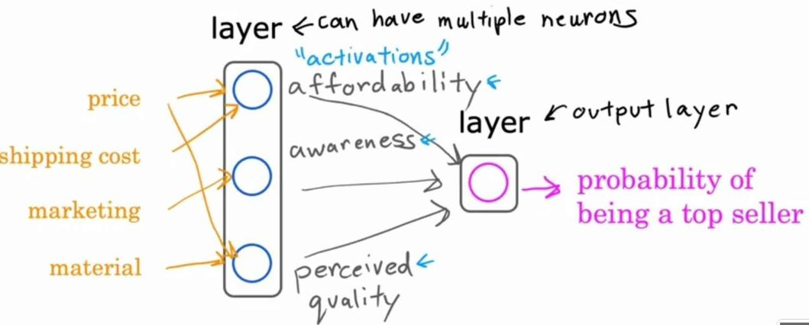
- **Goal**: Predict if a T-shirt will be a top seller.
- **Input Feature**: Price of the T-shirt.
- **Output**: Probability of being a top seller (using logistic regression).
  - Formula: $a = \frac{1}{1 + e^{-wx + b}}$
  - *a*: Activation (output of logistic regression).
- Note : in practice, nueral network connect each feature to all neurons   

### Components of a Neural Network
- **Neuron**: Simplified model; takes inputs (e.g., price) and outputs a single number (probability).
- **Hidden Layer**: Grouping of neurons.
  - Example features: 
    - Price and shipping costs (affordability).
    - Marketing (awareness).
    - Price and material quality (perceived quality).

### Neural Network Structure
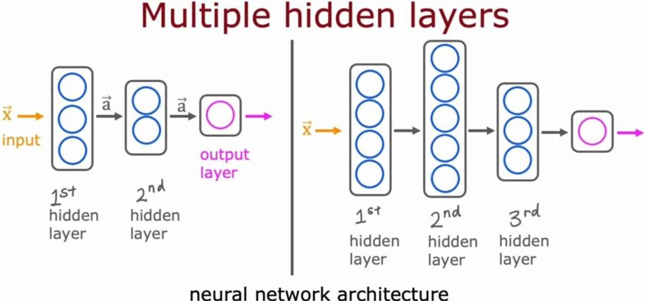
- **Input Layer**: Features vector (e.g., price, shipping, marketing, material).
- **Hidden Layer**: Processes input features to compute activations.
- **Output Layer**: Outputs final prediction (e.g., probability of being a top seller).

### Simplifications and Learning
- Neurons can access all features; they learn to focus on relevant ones.
- Neural networks can learn their own features, reducing manual feature engineering.

### Architecture Considerations
- **Layers**: Can have multiple hidden layers (*Multilayer Perceptron*).
- **Decisions**: How many hidden layers and neurons per layer affect performance.

## Neural Network in Computer Vision
### Face Recognition Application
- **Objective**: Train a neural network to identify a person from an image.
- **Input**: 1,000 x 1,000 pixel image represented as a matrix of pixel intensity values (0-255).
  - Flattened to a vector of **1,000,000** values.

### Neural Network Structure
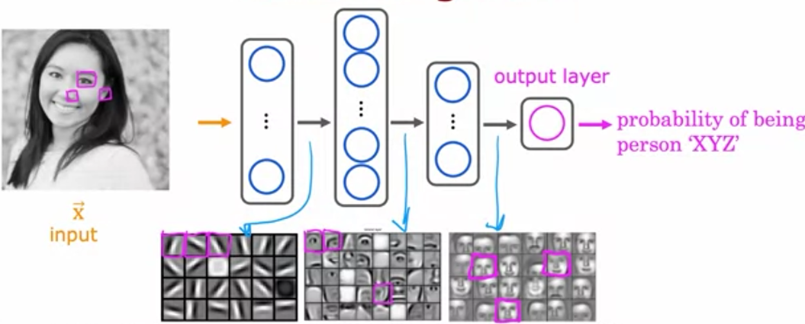
- **Layers**:
  - **Input Layer**: Accepts the flattened image vector.
  - **Hidden Layers**: Multiple layers extract features.
    - **First Hidden Layer**: Detects basic features (e.g., edges).
    - **Second Hidden Layer**: Groups features into recognizable parts (e.g., eyes, nose).
    - **Third Hidden Layer**: Combines parts into more complex shapes (e.g., full faces).
  - **Output Layer**: Estimates the probability of the identity of the person.

### Feature Learning
- **Automatic Feature Detection**: The neural network learns to identify features independently from the data.
- **Layer Functionality**:
  - **First Layer**: Detects short lines/edges.
  - **Second Layer**: Detects facial features from edges.
  - **Third Layer**: Recognizes complete facial structures.

### Generalization to Other Datasets
- If trained on car images:
  - **First Layer**: Learns edges.
  - **Second Layer**: Detects parts of cars.
  - **Third Layer**: Recognizes complete car shapes.

## Constructing a Layer of Neurons
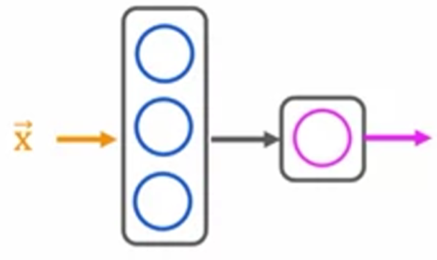
### Overview
- **Fundamental Building Block**: Layers of neurons form the core of modern neural networks.
- **Example Structure**: Input layer (4 features) → Hidden layer (3 neurons) → Output layer (1 neuron).

### Hidden Layer Computation
- **Inputs**: 4 input features to each of the 3 neurons.
- **Neuron Output**: Each neuron computes using logistic regression:
  - Neuron 1: 
    - Parameters: $ w_1, b_1 $
    - Activation: $ a_1 = g(w_1 \cdot x + b_1) $ (e.g., $ a_1 = 0.3 $)
  - Neuron 2: 
    - Parameters: $ w_2, b_2 $
    - Activation: $ a_2 = g(w_2 \cdot x + b_2) $ (e.g., $ a_2 = 0.7 $)
  - Neuron 3: 
    - Parameters: $ w_3, b_3 $
    - Activation: $ a_3 = g(w_3 \cdot x + b_3) $ (e.g., $ a_3 = 0.2 $)

### Layer Notation
- **Layer Indexing**: 
  - Input Layer: Layer 0
  - Hidden Layer: Layer 1
  - Output Layer: Layer 2
- **Superscript Notation**: 
  - $ a^{[1]} $ for Layer 1 outputs
  - $ w^{[1]}, b^{[1]} $ for Layer 1 parameters
  - $ a^{[2]} $ for Layer 2 outputs, and so on.

### Output Layer Computation
- **Input to Layer 2**: Output from Layer 1 $ a^{[1]} = [0.3, 0.7, 0.2] $.
- **Output Calculation**: 
  - Neuron computes: $ a^{[2]} = g(w^{[2]} \cdot a^{[1]} + b^{[2]}) $ (e.g., $ a^{[2]} = 0.84 $).
- **Final Prediction**: 
  - Thresholding: If $ a^{[2]} > 0.5 $, predict $ \hat{y} = 1 $; else $ \hat{y} = 0 $.

### Building a Complex Neural Network
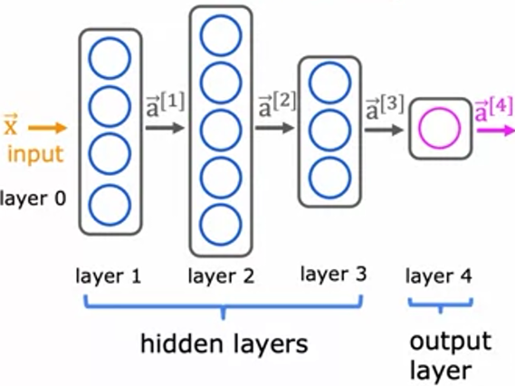
### Overview
- **Neural Network Structure**: 
  - Contains 4 layers: 
    - Input Layer (Layer 0)
    - Hidden Layers (Layers 1, 2, 3)
    - Output Layer (Layer 4)
  - Counting convention excludes the input layer.

### Layer 3 Computation
- **Input**: Vector $ a^{[2]} $ from Layer 2.
- **Output**: Vector $ a^{[3]} $ computed by three neurons.
- **Neuron Computation**:
  - For neuron 1, layer 3:
    - Activation: $ a_1^{[3]} = g(w_1^{[3]} \cdot a^{[2]} + b_1^{[3]}) $
  - For neuron 2, layer 3:
    - Activation: $ a_2^{[3]} = g(w_2^{[3]} \cdot a^{[2]} + b_2^{[3]}) $
  - For neuron 3, layer 3:
    - Activation: $ a_3^{[3]} = g(w_3^{[3]} \cdot a^{[2]} + b_3^{[3]}) $

### Notation
- **Superscript and Subscript**: 
  - Superscript denotes layer (e.g., $ 3 $ for Layer 3).
  - Subscript denotes neuron index (e.g., $ 2 $ for the second neuron).
- **General Form**:
  - Activation of layer $ l $, unit $ j $ : 
    $
    a_j^{[l]} = g(w_j^{[l]} \cdot a^{[l-1]} + b_j^{[l]})
    $
  
### Activation Function
- **Sigmoid Function**: $ g(z) = \frac{1}{1 + e^{-z}} $
- **Activation Function**: Refers to $ g $ in the context of neural networks.

### Input Vector
- **Input Vector Notation**: 
  - The input vector $ X $ is denoted as $ a^{[0]} $.
  - For the first layer, the activation becomes: 
    $
    a^{[1]} = g(W \cdot a^{[0]} + b)
    $
## Forward Propagation Algorithm for Neural Networks

### Overview
- **Purpose**: Enable neural networks to make predictions or inferences.
- **Example**: Handwritten digit recognition (classifying digits 0 and 1).

### Input Representation
- **Input Image**: 
  - 8x8 pixel grid (64 pixel intensity values).
  - Values range from 0 (black) to 255 (white).

### Neural Network Structure
- **Layers**:
  - **Input Layer**: 64 input features.
  - **Hidden Layer 1**: 25 neurons.
  - **Hidden Layer 2**: 15 neurons.
  - **Output Layer**: 1 neuron (probability of digit being 1).

### Computation Steps
1. **From Input $X$ to Hidden Layer 1 $ a^{[1]}$**:
   - Computation: 
   $
   a^{[1]} = g(W^{[1]} \cdot a^{[0]} + b^{[1]})
   $
   - $ a^{[1]}$ is a vector with 25 values.

2. **From Hidden Layer 1 $ a^{[1]}$ to Hidden Layer 2 $ a^{[2]}$**:
   - Computation: 
   $
   a^{[2]} = g(W^{[2]} \cdot a^{[1]} + b^{[2]})
   $
   - $ a^{[2]}$ is a vector with 15 values.

3. **From Hidden Layer 2 $ a^{[2]}$ to Output Layer $ a^{[3]}$**:
   - Computation: 
   $
   a^{[3]} = W^{[3]} \cdot a^{[2]} + b^{[3]}
   $
   - $ a^{[3]}$ is a scalar (single output).

### Final Output
- **Binary Classification**: 
  - Threshold $ a^{[3]}$ at 0.5 to determine if the digit is 1 or 0.
  - Output function: $ f(X)$ denotes the output of the neural network.

### Terminology
- **Forward Propagation**: Process of computing outputs from inputs moving from left to right through the network.
- **Backward Propagation**: Algorithm used for learning (discussed in the next week).

### Neural Network Architecture
- Typical architecture: More neurons in earlier layers, decreasing as you approach the output layer.
## Reflections on Artificial General Intelligence (AGI)
### Definitions
- **ANI (Artificial Narrow Intelligence)**: 
  - AI that performs specific tasks exceptionally well (e.g., smart speakers, self-driving cars).
  - Recent years have seen significant progress in ANI, contributing to advancements in AI.

- **AGI (Artificial General Intelligence)**: 
  - AI that can perform any cognitive task that a human can do.
  - Despite progress in ANI, actual advancements toward AGI remain unclear.

## General Note:
```python
import numpy as np 
A = np.array([[200.0],[17.0]])
W = np.array([[ 1,-3,5],[-2,4,-6]])
B  = np.array([[-1],[1],[2]])
```
```python
Z = np.dot(W.T,A) + B 
print(Z.T)
```
Same Output
```python
Z = np.matmul(A.T,W) + B.T 
print(Z)
```
## Practise Lab
[Neural Network using numpy](/C2_W1_Assignment%20implementing%20Neural%20Network%20with%20numpy.ipynb)
<hr style="border:0.02px solid pink">

# Neural Network Training
## Steps in TensorFlow to Train the Neural Network
1. **Specify the Model**:
   - Sequentially string together layers of the neural network.
   - Layers:
     - First hidden layer: 25 units with sigmoid activation.
     - Second hidden layer.
     - Output layer.

2. **Compile the Model**:
   - Specify the **loss function**:
     - Use **binary crossentropy** as the loss function.
   - Loss function details will be covered in the next video.

3. **Fit the Model**:
   - Call the `fit` function to train the model using the specified loss function and dataset (X, Y).
   - **Epochs**: A technical term for the number of steps/iterations of a learning algorithm like gradient descent.

### Step 2 : Compile The Model
Logistic regression function: 
$$ z = W \cdot X + B $$
$$ f(x) = \frac{1}{1 + e^{-z}} $$

- **Loss and Cost Functions**:
  - **Loss function**: Measures how well the model performs on a single training example:

     $\text{Loss} = -Y \cdot \log(f(x)) - (1 - Y) \cdot \log(1 - f(x))$
  - **Cost function (J)**: The average of the loss function over all training examples:

     $J(W, B) = \frac{1}{m} \sum_{i=1}^{m} \text{Loss}(f(x^{(i)}), y^{(i)})$

- Example Command : 
  ```python
  model.compile(loss=BinaryCrossentropy())
  ```
---
### Step 3: Fit / Train the Model
- Use **Gradient Descent** to minimize the cost function:
  - Update the parameters $W$ and $ B $ using the learning rate $ \alpha$:

    $W_{l,j} = W_{l,j} - \alpha \cdot \frac{\partial J}{\partial W_{l,j}}$

    $B_{l,j} = B_{l,j} - \alpha \cdot \frac{\partial J}{\partial B_{l,j}}$
- TensorFlow automatically computes the **partial derivatives** using **backpropagation** within the `fit` function.
- Example command :
  ```python
  model.fit(X, Y, epochs=100)
  ```

## Activation Functions
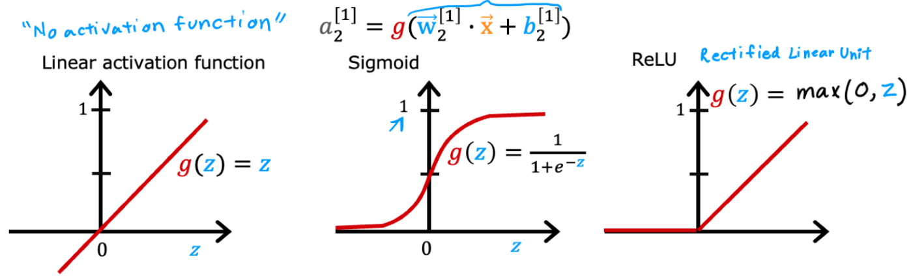
### Sigmoid Activation Function

- **Sigmoid Function** is often used to output a value between 0 and 1.
- In the hidden layers and the output layer, we've used sigmoid because it builds on logistic regression. 
- Equation
`g(z) = 1 / (1 + e^(-z))`

- It's great for binary outcomes (i.e., output between 0 and 1).
  
---

### ReLU (Rectified Linear Unit)

- **ReLU** is an activation function that allows neurons to output **any non-negative value**.
- ReLU is more effective when modeling continuous values that aren’t just binary (0 or 1).

### ReLU Activation Function
`g(z) = max(0, z)`

- If `z` is positive, it outputs `z`, else it outputs 0.
  
#### Characteristics
- Helps model outputs that can take on any non-negative value (awareness example).
- ReLU is particularly useful when you want to allow a unit to have much larger positive values.

---

### Linear Activation Function
- **Linear Activation Function** outputs the input directly, i.e., `g(z) = z`.
- Sometimes, this is referred to as **"no activation function"** since it doesn't alter the input value.

- Equation
`g(z) = z`

- Often used in regression tasks, not classification.
- Allows neurons to output continuous real-valued numbers.

---

### Choosing Activation Functions in Neural Networks
#### Output Layer Activation Functions

#### Binary Classification
- **Activation Function**: **Sigmoid**
  - **Use Case**: When the target label $y$ is either 0 or 1.
  - **Reason**: Neural network learns to predict the probability that $y$ is equal to 1, similar to logistic regression.

#### Regression Problems
- **Activation Function**: **Linear**
  - **Use Case**: Predicting values that can be both positive and negative (e.g., stock price changes).
  - **Reason**: Allows outputs to take on positive or negative values.

#### Non-negative Values
- **Activation Function**: **ReLU (Rectified Linear Unit)**
  - **Use Case**: Predicting values that are always non-negative (e.g., house prices).
  - **Reason**: ReLU only outputs non-negative values (0 or positive).

---

#### Hidden Layer Activation Function

- **Common Choice**: **ReLU**
  - **Reason**: 
    - Faster computation (`max(0, z)`) compared to sigmoid.
    - ReLU goes flat in only one part of the graph, avoiding slow (vanish) gradient descent learning.
    - Empirical evidence shows that ReLU can help neural networks learn faster.

---

#### Summary of Recommendations Activation Function

- For the Output Layer
  - **Sigmoid**: Use for binary classification problems.
  - **Linear**: Use when y can be positive or negative.
  - **ReLU**: Use when y can only take on non-negative values.

- For the Hidden Layers
  - **Default**: Use **ReLU** activation function.

### TensorFlow Implementation Example
- To implement activation functions in TensorFlow:
```python
  model.add(Dense(units, activation='relu'))  # Hidden Layer
  model.add(Dense(units, activation='sigmoid'))  # Output Layer (binary classification)
  # Or for linear
  model.add(Dense(units, activation='linear'))  # Output Layer (regression)
```
### Why do we need Activation Function?
##### Linear Activation Functions in Neural Networks
- **Issue**: Using linear activation functions in all neurons makes the neural network behave like **linear regression**.
  - **Result**: The network won't fit anything more complex than what a linear regression model can.

---

##### Example: Simple Neural Network
- **Scenario**: A neural network with:
  - **Input**: $x$
  - **Hidden Unit**: Parameters $w_1$ and $b_1$, output $a_1$
  - **Output Layer**: Parameters $w_2$ and $b_2$, output $a_2$
- **Using Linear Activation**:
  - **Computation**: 
    - $a_1 = w_1 \cdot x + b_1$
    - $a_2 = w_2 \cdot a_1 + b_2$
    - Substitute $a_1$ into $a_2$ :
      $a_2 = w_2 \cdot (w_1 \cdot x + b_1) + b_2$
    - Simplify: $a_2 = (w_2 \cdot w_1) \cdot x + (w_2 \cdot b_1 + b_2) = W \cdot X + b$
  - **Conclusion**: 
    - $a_2$ is a linear function of $x$, equivalent to **linear regression**.
    - A neural network with linear activations is no more powerful than a simple linear regression model.

---

##### General Case: Multiple Layers
- **All Layers with Linear Activation**: 
  - The model becomes equivalent to **linear regression**.
- **Linear Activation in Hidden Layers, Logistic in Output**: 
  - The model becomes equivalent to **logistic regression**:
    $a_4 = \frac{1}{1 + e^{-(wx + b)}}$
  - **Result**: The network does nothing more than logistic regression.

---

##### Key Rule: 
- **Do not use linear activation functions** in hidden layers of a neural network.
- **Recommendation**: Use **ReLU** for hidden layers.
---
## Multiclass Classification
- **Multiclass Classification** refers to classification problems where the target label y can take on more than two distinct categories.
- **Contrast with Binary Classification**: While binary classification deals with two classes (e.g., 0 or 1), multiclass classification involves three or more classes.

### Examples of Multiclass Classification

- Handwritten Digit Recognition : Distinguish between digits 0 through 9
-  Reading Postal Codes : 10 possible digits per position
- Medical Diagnosis : Multiple diseases (e.g., Disease A, Disease B, Disease C, etc.)
- Visual Defect Inspection : Various defect types (e.g., scratches, discoloration, chips)

### Multiclass Classification Characteristics
- **Discrete Categories** : y takes on a finite set of discrete values (e.g., 0, 1, 2, 3)
- **Probability Estimation**: Estimate the probability of y belonging to each class.
- **Decision Boundaries**: The algorithm learns boundaries that separate multiple classes in the feature space.

### Visual Representation
- **Classes**: Multiple categories (e.g., circles, squares, triangles, and stars).
- **Decision Boundary**: Divides the feature space into multiple regions, each corresponding to a different class.
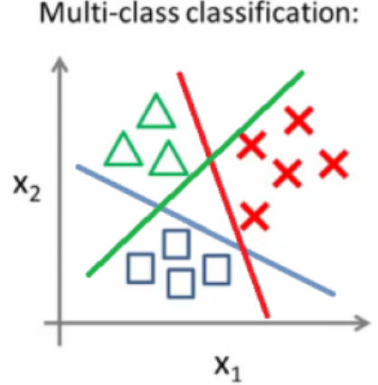

### Extending Logistic Regression to Multiclass
- Logistic Regression (Binary)
  - **Function**: 
    $f(x) = \sigma(w \cdot x + b) = \frac{1}{1 + e^{-(w \cdot x + b)}}$
  - **Output**: Probability of y = 1.

- Softmax Regression (Multiclass)
  - **Generalization**: Extends logistic regression to handle multiple classes.
  - **Function**:
    $$\text{softmax}(z_i) = \frac{e^{z_i}}{\sum_{j=1}^{K} e^{z_j}} \quad \text{for } i = 1, 2, \dots, K$$
    where K is the number of classes.
  - **Output**: Probability distribution over K classes.
  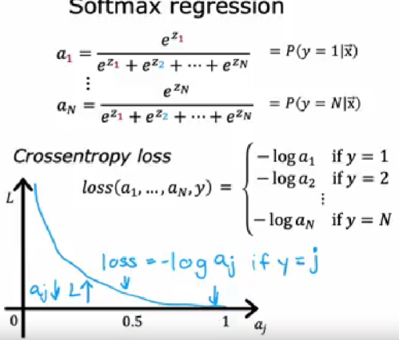
### Neural Networks for Multiclass Classification
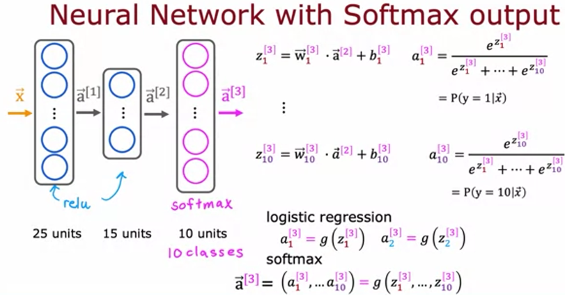
- Architecture
  - **Input Layer**: Features vector X
  - **Hidden Layers**: One or more layers with activation functions (commonly ReLU).
  - **Output Layer**: 
    - **Activation Function**: Softmax.
    - **Units**: K units, where K is the number of classes.

- Example
  - **Task**: Classify handwritten digits (0-9).
  - **Network Structure**:
    - **Input Layer**: 64 input features (e.g., 8x8 pixel image).
    - **Hidden Layer 1**: 25 neurons with ReLU activation.
    - **Hidden Layer 2**: 15 neurons with ReLU activation.
    - **Output Layer**: 10 neurons with Softmax activation.

  - Forward Propagation Steps
    1. **Input to Hidden Layer 1**:
      $a^{[1]} = \text{ReLU}(W^{[1]} \cdot X + b^{[1]})$
    2. **Hidden Layer 1 to Hidden Layer 2**:
      $a^{[2]} = \text{ReLU}(W^{[2]} \cdot a^{[1]} + b^{[2]})$
    3. **Hidden Layer 2 to Output Layer**:
      $a^{[3]} = \text{Softmax}(W^{[3]} \cdot a^{[2]} + b^{[3]})$
- code of Softmax 
  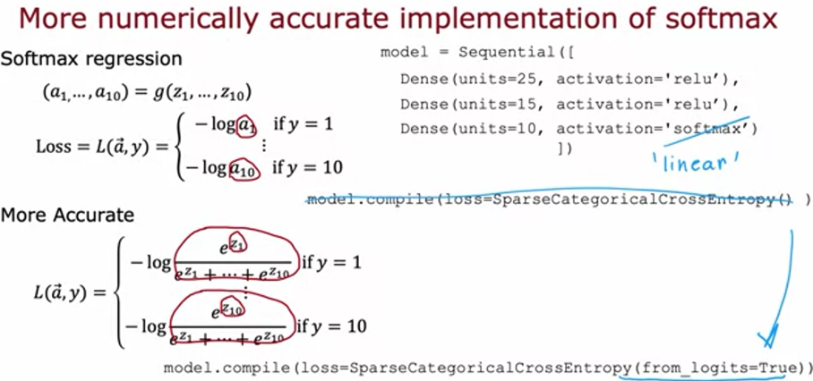
  - the **output layer uses a linear activation** (instead of softmax) and directly computes the logits $z_1$ through $z_n$
  - The **loss function** computes the softmax internally using more **stable calculations**.
  - When using TensorFlow, you can set the parameter `from_logits=True` in the loss function. This allows TensorFlow to handle the **logits** raw values  z and **optimize** the calculation for numerical stability.
## Classification with multiple outputs
#### Overview
- **Multi-class classification**: A classification problem where the output label Y can be any one of two or more possible categories.
- **Multi-label classification**: A classification problem where each input can be associated with **multiple labels** simultaneously.
- **Example: Self-Driving Car**
  - Consider building a system for a **self-driving car**:
    - For a given image x, you might ask:
      - Is there a car?
      - Is there a bus?
      - Are there pedestrians?
  - The labels for this input could be:
    - **Yes car**, **No bus**, **Yes pedestrians**.
    - **No car**, **Yes bus**, **No pedestrians**.
    
  **Key Differences**
  - In **multi-class classification**, \( Y \) is a **single number** that can take on multiple values.
    - Example: Handwritten digit classification (0-9).
  - In **multi-label classification**, \( Y \) is a **vector** of binary values.
    - Example: [1, 0, 1] (car, no bus, pedestrian).

---
#### Building Neural Networks for Multi-Label Classification

##### Approach 1: Separate Neural Networks
- Treat each label as a **separate binary classification problem**:
  - One neural network to detect cars.
  - Another neural network to detect buses.
  - A third neural network to detect pedestrians.

##### Approach 2: Single Neural Network
- Train a **single neural network** with multiple output nodes:
  - **Input**: Image X .
  - **Hidden layers**: Shared layers for learning common features.
  - **Output layer**:
    - A vector of 3 output neurons $a_1^3, a_2^3, a_3^3$, each using a **sigmoid activation** function.
    - $a_1^3$ : Probability of a car.
    - $a_2^3$ : Probability of a bus.
    - $a_3^3$ : Probability of pedestrians.
  
**Activation Function**
- **Sigmoid activation** function is used for each output node since these are **binary classification problems**.

## Adam Optimization Algorithm
### Limitations of Gradient Descent
- **Slow progress**: When the learning rate $\alpha$ is small, gradient descent can take small, slow steps towards the minimum.
- **Oscillation**: When $\alpha$ is too large, gradient descent can overshoot the minimum and oscillate back and forth.

### Adam Algorithm: An Improvement
- **Adam**: Stands for **Adaptive Moment Estimation**.
  - It adapts the **learning rate** based on the behavior of the gradient for each parameter.
  
### Key Features
- **Automatic learning rate adjustment**:
  - **Increase learning rate**: If gradient descent keeps moving in the **same direction**, increase $\alpha$ to take larger steps.
  - **Decrease learning rate**: If gradient descent is **oscillating**, decrease $\alpha$ to stabilize the steps.

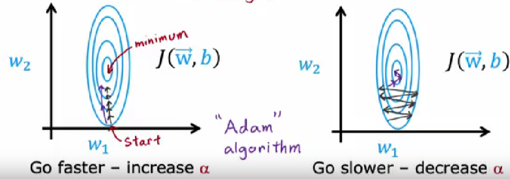  
- **Individual learning rates for each parameter**:
  - For each parameter $w_1, w_2, ..., w_n$, and bias b, Adam uses a different learning rate $\alpha_1, \alpha_2, ..., \alpha_n, \alpha_b$
  - This allows the algorithm to optimize each parameter differently based on its behavior.

### How Adam Works
1. **Momentum**: Adam keeps track of an exponentially decaying average of past gradients (helps in speeding up convergence).
2. **Adaptive learning rates**: 
   - If a parameter consistently moves in the same direction, Adam increases the learning rate for that parameter.
   - If a parameter oscillates, Adam decreases its learning rate.

**Implementing Adam in Neural Networks**
- The Adam algorithm is easily integrated into modern deep learning libraries like TensorFlow/Keras:
```python
  model.compile(optimizer=tf.keras.optimizers.Adam(learning_rate=1e-3))
```
## Neural Network Layers

- **Dense Layer** (or fully connected layer):
  - Every neuron in the layer receives input from **all activations** from the previous layer.
  - You can build **powerful learning algorithms** using just dense layers.
  - The activation of a neuron in a dense layer is :
    $a^{[l]} = f(W^{[l]} \cdot a^{[l-1]} + b^{[l]})$
    where:
    - $a^{[l]}$ is the activation in layer l,
    - $W^{[l]}$ are the weights,
    - $b^{[l]}$ is the bias,
    - and f is the activation function.

- **Convolutional Layer (CNNs)**:
  - Instead of each neuron receiving input from the **entire previous layer**, it only looks at a **small region** of the input.
  - Each neuron in a convolutional layer scans a limited region of the input to compute its activation.
  - Used extensively in **computer vision** and **signal processing**.

- Example:
  - Consider a **handwritten digit image**:
    - In a dense layer, every neuron looks at **all pixels**.
    - In a convolutional layer, neurons only look at **small, localized regions** of the image (e.g., 3x3 or 5x5 pixel windows).

- Benefits of Convolutional Layers:
  1. **Faster computation**:
    - By focusing on small regions, fewer connections are computed.
  2. **Less prone to overfitting**:
    - It requires **less training data** compared to dense layers and generalizes better.
  3. **Parameter sharing**:
    - A filter (or kernel) is shared across different parts of the image, reducing the number of parameters.

- Example: Convolutional Neural Network (CNN)
  - **Input**: An ECG (electrocardiogram) signal for heart disease classification.
    - 100 time points of signal data : $X_1, X_2, ..., X_{100}$
    
  - First Hidden Layer:
    - Each neuron looks at **small windows** of the input:
      - First neuron: looks at $X_1$ to $X_{20}$.
      - Second neuron: looks at $X_{11}$ to $X_{30}$.
      - And so on, each neuron looks at a different portion of the input.

  - Second Hidden Layer:
    - Again, each neuron looks at small regions from the **first hidden layer**'s activations:
      - First neuron: looks at activations $A_1$ to $A_5$.
      - Second neuron: looks at $A_3$ to $A_7$
      - This allows the network to **extract hierarchical features** from the data.

### Architecture Choices in CNNs:
- **Window size**: How many inputs each neuron should look at (e.g., 3x3, 5x5).
- **Stride**: How much the window moves across the input (e.g., moving by 1 or 2 units).
- **Number of neurons per layer**: Determines how many different features can be extracted.

## Types of Layers in Modern Neural Networks
- **Convolutional layers** are just one example of specialized layers.
- Other types include:
  - **Transformers**
  - **LSTM (Long Short-Term Memory) layers**
  - **Attention layers**
- These layers are used to create even more powerful neural networks for tasks like **language modeling**, **machine translation**, and **time-series forecasting**.
 <hr style="border:1px solid pink">

# Advice for applying machine Learning

<hr style="border:1px solid pink">

# Decision trees